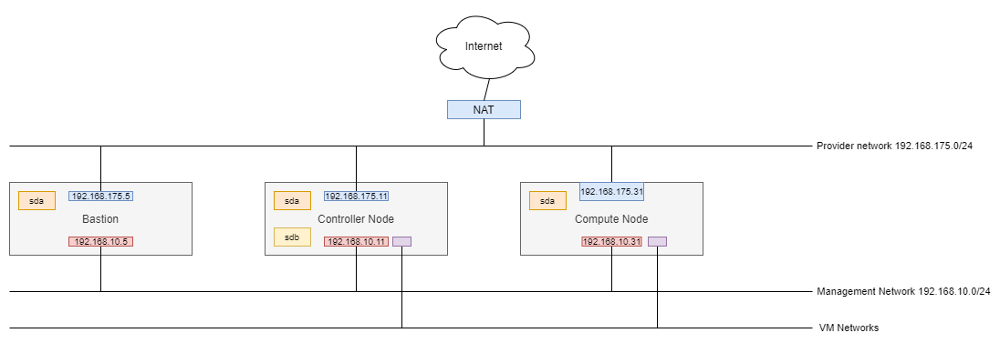

# Setup OpenStack Cloud For Lab Purpose With 2-Nodes Configuration

## Overview And Requirements

Setup a OpenStack Cloud For Lab Purpose, should not use for production. Using following Components Provides By Virtualization Software as:
Virtual Machine Manager (Linux) Or VMWare Workstation (Windows):



Controller node:

- hostname: compute01
- Management IP: 192.168.10.11 - ens36
- Node External IP and Provider Network Interface: 192.168.175.11 - ens33
- Openstack VLAN network interface: ens37
- 4 Network Interfaces: ens33, ens36, ens37
- 2 Disk drives, one for Host OS, one for Cinder Storage
- Ubuntu Server 18.04

Compute node:

- Management IP: 192.168.10.31 - ens36
- Node External IP and Provider Network Interface: 192.168.175.31 - ens33
- Openstack VLAN network interface: ens37
- 3 Network Interfaces: ens33, ens36, ens37
- 1 Disk drives, for Host OS
- Ubuntu Server 18.04

Bastion node:

- Management IP: 192.168.10.5
- External IP: 192.168.175.5
- 2 Network Interfaces
- 1 Disk drives, for Host OS
- Ubuntu Server 18.04

## Install Version

- Kolla-ansible version: 7.2.1
- OpenStack version: Rocky

## Prepare Controller Node

### Prepare Networking

Setup networking configuration:

```yaml
# /etc/netplan/00-installer-config.yaml
network:
  version: 2
  renderer: networkd
  ethernets:
          ens33:
                  addresses:
                          - 192.168.175.11/24
                  gateway4: 192.168.175.2
                  nameservers:
                          addresses: [8.8.8.8, 8.8.4.4]
          
          ens36:
                  addresses:
                          - 192.168.10.11/24
          ens37: {}                          
```

apply it

```bash
netplan apply
```

### Prepare Storage

Configure LVM2

```bash
apt-get install lvm2
```

Create volume-group `cinder-volumes`:

```bash
pvcreate /dev/sdb
vgcreate cinder-volumes /dev/sdb
```

Configure LVM to scan only /dev/sdb:

```bash
# file /etc/lvm/lvm.conf

devices {
...
filter = [ "a/sda/", "a/sdb/", "r/.*/"]
```

## Prepare Compute Node

### Prepare Networking

Setup networking configuration:

```yaml
# /etc/netplan/00-installer-config.yaml
network:
  version: 2
  renderer: networkd
  ethernets:
          ens33:
                  addresses:
                          - 192.168.175.31/24
                  gateway4: 192.168.175.2
                  nameservers:
                          addresses: [8.8.8.8, 8.8.4.4]
          
          ens36:
                  addresses:
                          - 192.168.10.31/24
          ens37: {}
```

apply it

```bash
netplan apply
```

### Prepare Storage Configuration For Compute Node

Add configfs module to /etc/modules

```bash
# file /etc/modules
configfs
```

Rebuild initramfs using: `update-initramfs -u` command

Stop open-iscsi system service due to its conflicts with iscsid container.

```bash
systemctl stop open-iscsi; systemctl stop iscsid
systemctl disable open-iscsi; systemctl disable iscsid
```

Make sure configfs gets mounted during a server boot up process. There are multiple ways to accomplish it, one example:

```bash
mount -t configfs /etc/rc.local /sys/kernel/config
```

## Prepare Bastion Node

### Setup networking configuration

```yaml
# /etc/netplan/00-installer-config.yaml
network:
  version: 2
  renderer: networkd
  ethernets:
          ens33:
                  addresses:
                          - 192.168.175.5/24
                  gateway4: 192.168.175.2
                  nameservers:
                          addresses: [8.8.8.8, 8.8.4.4]
          
          ens36:
                  addresses:
                          - 192.168.10.5/24
```

apply it

```bash
netplan apply
```

### Setup kolla-ansible deploy environment

Install required packages on bastion node:

```bash
apt-get update
apt-get install python-pip
pip install -U pip
apt-get install python
apt-get install python-dev libffi-dev gcc libssl-dev python-selinux python-setuptools
```

Create deploy folder:

```bash
mkdir -p openstack-2-nodes
cd openstack-2-nodes
```

Create Virtual Environment and Update pip

```bash
virtualenv venv
source venv/bin/activate
pip install -U pip
```

Install ansible and kolla-ansible

```bash
pip install ansible==2.8.15
pip install kolla-ansible==7.2.1
```

Create kolla-ansible working directory `/etc/kolla`

```bash
sudo mkdir -p /etc/kolla
sudo chown $USER:$USER /etc/kolla
```

Create kolla-ansible configuration files in `/etc/kolla` directory and ansible inventory file in `openstack-2-nodes` directory:

```bash
cp -r venv/share/kolla-ansible/etc_examples/kolla/* /etc/kolla
cp venv/share/kolla-ansible/ansible/inventory/* .
```

Create ansible configuration file `ansible.cfg` in `openstack-2-nodes` directory:

```bash
[defaults]
host_key_checking=False
pipelining=True
forks=100
```

### Setup ansbile inventory file

Update ansible inventory file `multinode` with following content

```ini
[control]
192.168.10.11 ansible_user=cloud ansible_password=foobar ansible_become=true ansible_become_pass=foorbar

[network:children]
control

[compute]
192.168.10.31 ansible_user=cloud ansible_password=foobar ansible_become=true ansible_become_pass=foorbar

[monitoring:children]
control

[storage:children]
control

[deployment]
localhost       ansible_connection=local ansible_user=cloud ansible_password=foobar become=true ansible_become_pass=foorbar

# use localhost and sudo
```

Verify ansible inventory configuration file

```bash
ansible -i multinode all -m ping
```

Generate password file `/etc/kolla/passwords.yml

```bash
kolla-genpwd
```

### Setup kolla-ansible configuration file

Next step, we have to update config file `/etc/kolla/globals.yml` with following contents

```yaml
#cp /etc/kolla/globals.yml /etc/kolla/globals.yml.bak
#file /etc/kolla/globals.yml
---
kolla_base_distro: "centos"
kolla_install_type: "source"
openstack_release: "rocky"
kolla_internal_vip_address: 192.168.10.11
network_interface: "ens36"
neutron_bridge_name: "br-ex,br-ex2"
neutron_external_interface: "ens33,ens37"

nova_compute_virt_type: "kvm"
enable_haproxy: "no"
enable_cinder: "yes"
enable_cinder_backup: "no"
enable_cinder_backend_lvm: "yes"
enable_neutron_provider_networks: "yes"


```

## References

- <https://docs.openstack.org/kolla-ansible/rocky/user/quickstart.html>
- <https://docs.openstack.org/kolla-ansible/4.0.0/cinder-guide.html>
- <https://bugs.launchpad.net/kolla-ansible/+bug/1626259>