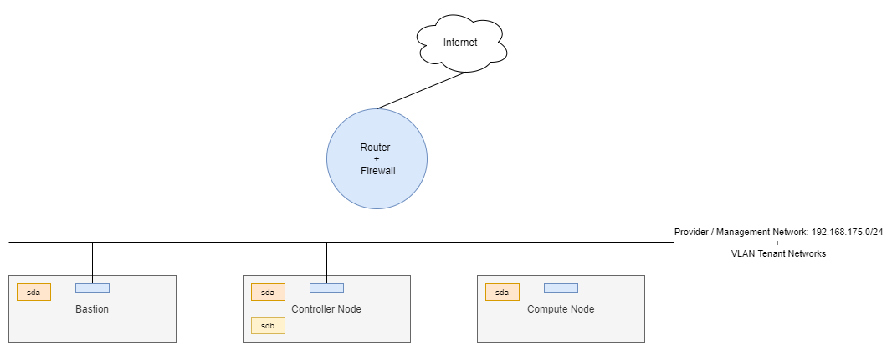
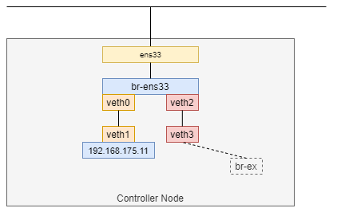

# Setup OpenStack Cloud For Single-Interface Environment

## Overview And Requirements

Some notes about deploy OpenStack on Single-Interface Environment

Setup a OpenStack Cloud For Lab Purpose, should not use for production.

Using following Components Provides By Virtualization Software as:
Virtual Machine Manager (Linux) Or VMWare Workstation (Windows):



## Components Planning

Controller node:

- hostname: compute01
- Management IP: 192.168.175.11
- Single Network Interface: ens33
- 2 Disk drives, one for Host OS (`/sda` - LVM), one for Cinder Storage (`/sdb`)
- Ubuntu Server 18.04

Compute node:

- Management IP: 192.168.175.31
- Single Network Interface: ens33
- 1 Disk drives, for Host OS (`/sda` - LVM)
- Ubuntu Server 18.04

Bastion node:

- Management IP: 192.168.175.5
- Single Network Interface: ens33
- 1 Disk drives, for Host OS (`/sda` - LVM)
- Ubuntu Server 18.04

## Install Version

- Kolla-ansible version: 7.2.1
- OpenStack version: Train

## Prepare Controller Node

### Prepare Networking

Setup networking configuration follow diagram:



```ini
# /etc/systemd/network/25-veth-0-1.netdev
[NetDev]
Name=veth0
Kind=veth

[Peer]
Name=veth1
```

```ini
# /etc/systemd/network/25-veth-2-3.netdev
[NetDev]
Name=veth2
Kind=veth

[Peer]
Name=veth3
```

```yaml
# /etc/netplan/00-installer-config.yaml
network:
  version: 2
  renderer: networkd
  ethernets:
    ens33:
      dhcp4: false
      dhcp6: false
    veth0: {}
    veth1:
      addresses:
        - 192.168.175.11/24
      gateway4: 192.168.175.2
      nameservers:
        addresses: [8.8.8.8, 8.8.4.4]
    veth2: {}
    veth3: {}  
  bridges:
    br-ens33:
      interfaces: 
        - ens33
        - veth0
        - veth2
      dhcp4: false        
      dhcp6: false
```

apply it

```bash
systemctl restart systemd-networkd
netplan apply
```

Verify network configuration

```bash
ip a
1: lo: <LOOPBACK,UP,LOWER_UP> mtu 65536 qdisc noqueue state UNKNOWN group default qlen 1000
    link/loopback 00:00:00:00:00:00 brd 00:00:00:00:00:00
    inet 127.0.0.1/8 scope host lo
       valid_lft forever preferred_lft forever
    inet6 ::1/128 scope host 
       valid_lft forever preferred_lft forever
2: ens33: <BROADCAST,MULTICAST,UP,LOWER_UP> mtu 1500 qdisc fq_codel master br-ens33 state UP group default qlen 1000
    link/ether 00:0c:29:e2:1a:1a brd ff:ff:ff:ff:ff:ff
3: veth3@veth2: <BROADCAST,MULTICAST,UP,LOWER_UP> mtu 1500 qdisc noqueue state UP group default qlen 1000
    link/ether ea:1a:1e:9b:b6:7b brd ff:ff:ff:ff:ff:ff
    inet6 fe80::e81a:1eff:fe9b:b67b/64 scope link 
       valid_lft forever preferred_lft forever
4: veth2@veth3: <BROADCAST,MULTICAST,UP,LOWER_UP> mtu 1500 qdisc noqueue master br-ens33 state UP group default qlen 1000
    link/ether 8a:99:2c:2a:ac:7d brd ff:ff:ff:ff:ff:ff
5: veth1@veth0: <BROADCAST,MULTICAST,UP,LOWER_UP> mtu 1500 qdisc noqueue state UP group default qlen 1000
    link/ether ee:b8:0e:2f:25:6d brd ff:ff:ff:ff:ff:ff
    inet 192.168.175.11/24 brd 192.168.175.255 scope global veth1
       valid_lft forever preferred_lft forever
    inet6 fe80::ecb8:eff:fe2f:256d/64 scope link 
       valid_lft forever preferred_lft forever
6: veth0@veth1: <BROADCAST,MULTICAST,UP,LOWER_UP> mtu 1500 qdisc noqueue master br-ens33 state UP group default qlen 1000
    link/ether 76:f0:5c:fe:1b:98 brd ff:ff:ff:ff:ff:ff
7: br-ens33: <BROADCAST,MULTICAST,UP,LOWER_UP> mtu 1500 qdisc noqueue state UP group default qlen 1000
    link/ether de:91:92:bd:3d:e4 brd ff:ff:ff:ff:ff:ff
    inet6 fe80::dc91:92ff:febd:3de4/64 scope link 
       valid_lft forever preferred_lft forever
```

When Docker deamon is installed and started, default forward policy will be DROP when docker insert rule
`-P FORWARD DROP` to iptables. To prevent connection lost after this iptables rule is applied, 
add two iptables rules to allow packet forwarding in br-ens33 bridge:

Install iptables pernament packages: `sudo apt install iptables-persistent netfilter-persistent`

Add iptables rules to configuration file:

```bash
# file /etc/iptables/rules.v4
*filter

-A FORWARD -i br-ens33 -j ACCEPT
-A FORWARD -o br-ens33 -j ACCEPT

COMMIT
```

reload iptables configuration: `systemctl restart netfilter-persistent`

Verify:

```bash
iptables -S

-P INPUT ACCEPT
-P FORWARD ACCEPT
-P OUTPUT ACCEPT
-A FORWARD -i br-ens33 -j ACCEPT
-A FORWARD -o br-ens33 -j ACCEPT
```

### Prepare Storage

Configure LVM2

```bash
apt-get install lvm2
```

Create volume-group `cinder-volumes`:

```bash
pvcreate /dev/sdb
vgcreate cinder-volumes /dev/sdb
```

Configure LVM to scan only /dev/sdb:

```bash
# file /etc/lvm/lvm.conf

devices {
...
filter = [ "a/sda/", "a/sdb/", "r/.*/"]
```

## Prepare Compute Node

### Prepare Networking

Setup networking configuration as controller networking:

```ini
# /etc/systemd/network/25-veth-0-1.netdev
[NetDev]
Name=veth0
Kind=veth

[Peer]
Name=veth1
```

```ini
# /etc/systemd/network/25-veth-2-3.netdev
[NetDev]
Name=veth2
Kind=veth

[Peer]
Name=veth3
```

```yaml
# /etc/netplan/00-installer-config.yaml
network:
  version: 2
  renderer: networkd
  ethernets:
    ens33:
      dhcp4: false
      dhcp6: false
    veth0: {}
    veth1:
      addresses:
        - 192.168.175.31/24
      gateway4: 192.168.175.2
      nameservers:
        addresses: [8.8.8.8, 8.8.4.4]
    veth2: {}
    veth3: {}  
  bridges:
    br-ens33:
      interfaces: 
        - ens33
        - veth0
        - veth2
      dhcp4: false        
      dhcp6: false
```

apply it

```bash
systemctl restart systemd-networkd
netplan apply
```

Add iptables rules to allow packet forwarding in br-ens33 bridge:

Install iptables pernament packages: `sudo apt install iptables-persistent netfilter-persistent`

Add iptables rules to configuration file:

```bash
# file /etc/iptables/rules.v4
*filter

-A FORWARD -i br-ens33 -j ACCEPT
-A FORWARD -o br-ens33 -j ACCEPT

COMMIT
```

reload iptables configuration: `systemctl restart netfilter-persistent`

Verify:

```bash
iptables -S

-P INPUT ACCEPT
-P FORWARD ACCEPT
-P OUTPUT ACCEPT
-A FORWARD -i br-ens33 -j ACCEPT
-A FORWARD -o br-ens33 -j ACCEPT
```

### Prepare Storage Configuration For Compute Node

Add configfs module to /etc/modules

```bash
# file /etc/modules
configfs
```

Rebuild initramfs using: `update-initramfs -u` command

Stop open-iscsi system service due to its conflicts with iscsid container.

```bash
systemctl stop open-iscsi 
systemctl stop iscsid
systemctl disable open-iscsi
systemctl disable iscsid
```

Make sure configfs gets mounted during a server boot up process. There are multiple ways to accomplish it, one example:

```bash
mount -t configfs /etc/rc.local /sys/kernel/config
```

## Prepare Bastion Node

### Setup networking configuration

```yaml
# /etc/netplan/00-installer-config.yaml
network:
  version: 2
  renderer: networkd
  ethernets:
          ens33:
                  addresses:
                          - 192.168.175.5/24
                  gateway4: 192.168.175.2
                  nameservers:
                          addresses: [8.8.8.8, 8.8.4.4]
```

apply it

```bash
netplan apply
```

### Setup kolla-ansible deploy environment

Install required packages on bastion node:

```bash
apt-get update
apt-get install python-pip
pip install -U pip
apt-get install python
apt-get install python-dev libffi-dev gcc libssl-dev python-selinux python-setuptools virtualenv sshpass
```

Create deploy folder:

```bash
mkdir -p openstack-2-nodes
cd openstack-2-nodes
```

Create Virtual Environment and Update pip

```bash
virtualenv venv
source venv/bin/activate
pip install -U pip
```

Install ansible and kolla-ansible for OpenStack Train Release

```bash
pip install 'ansible<2.10'
pip install kolla-ansible==9.2.0
```

Create kolla-ansible working directory `/etc/kolla`

```bash
sudo mkdir -p /etc/kolla
sudo chown $USER:$USER /etc/kolla
```

Create kolla-ansible configuration files in `/etc/kolla` directory and ansible inventory file in `openstack-2-nodes` directory:

```bash
cp -r venv/share/kolla-ansible/etc_examples/kolla/* /etc/kolla
cp venv/share/kolla-ansible/ansible/inventory/* .
```

Create ansible configuration file `ansible.cfg` in `openstack-2-nodes` directory:

```bash
[defaults]
host_key_checking=False
pipelining=True
forks=100
```

## Prepare Configurtion Files and Deploy OpenStack Cloud

### Setup ansbile inventory file

Update ansible inventory file `multinode` with following content

```ini
[control]
192.168.175.11 ansible_user=cloud ansible_password=foobar ansible_become=true ansible_become_pass=foorbar

[network:children]
control

[compute]
192.168.175.31 ansible_user=cloud ansible_password=foobar ansible_become=true ansible_become_pass=foorbar

[monitoring:children]
control

[storage:children]
control

[deployment]
localhost       ansible_connection=local ansible_user=cloud ansible_password=foobar become=true ansible_become_pass=foorbar

# use localhost and sudo
```

Verify ansible inventory configuration file

```bash
ansible -i multinode all -m ping
```

Generate password file `/etc/kolla/passwords.yml

```bash
kolla-genpwd
```

### Setup kolla-ansible configuration file

Next step, we have to update config file `/etc/kolla/globals.yml` with following contents

```yaml
#cp /etc/kolla/globals.yml /etc/kolla/globals.yml.bak
#file /etc/kolla/globals.yml
kolla_base_distro: "centos"
kolla_install_type: "source"
openstack_release: "train"
kolla_internal_vip_address: 192.168.175.11
network_interface: "veth1"
neutron_bridge_name: "br-ex"
neutron_external_interface: "veth3"

nova_compute_virt_type: "kvm"
enable_haproxy: "no"
enable_cinder: "yes"
enable_cinder_backup: "no"
enable_cinder_backend_lvm: "yes"
enable_neutron_provider_networks: "yes"
```

### Deploy OpenStack Cloud Using Kolla Ansible

On bastion node, perform following steps:

Check ansible connection: `ansible -i multinode all -m ping`

Perform bootstrap step: `kolla-ansible -i ./multinode bootstrap-servers`

Precheck environment: `kolla-ansible -i ./multinode prechecks`

## References

- <https://docs.openstack.org/kolla-ansible/train/user/quickstart.html>
- <https://docs.openstack.org/kolla-ansible/4.0.0/cinder-guide.html>
- <https://bugs.launchpad.net/kolla-ansible/+bug/1626259>
- <https://rahulait.wordpress.com/2016/09/20/openstack-and-containers-project-kolla/>
